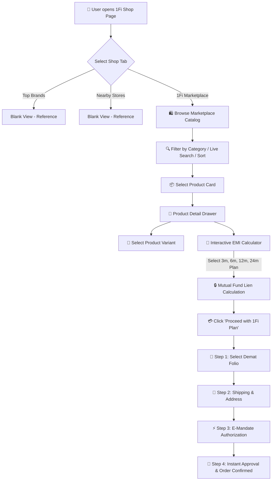
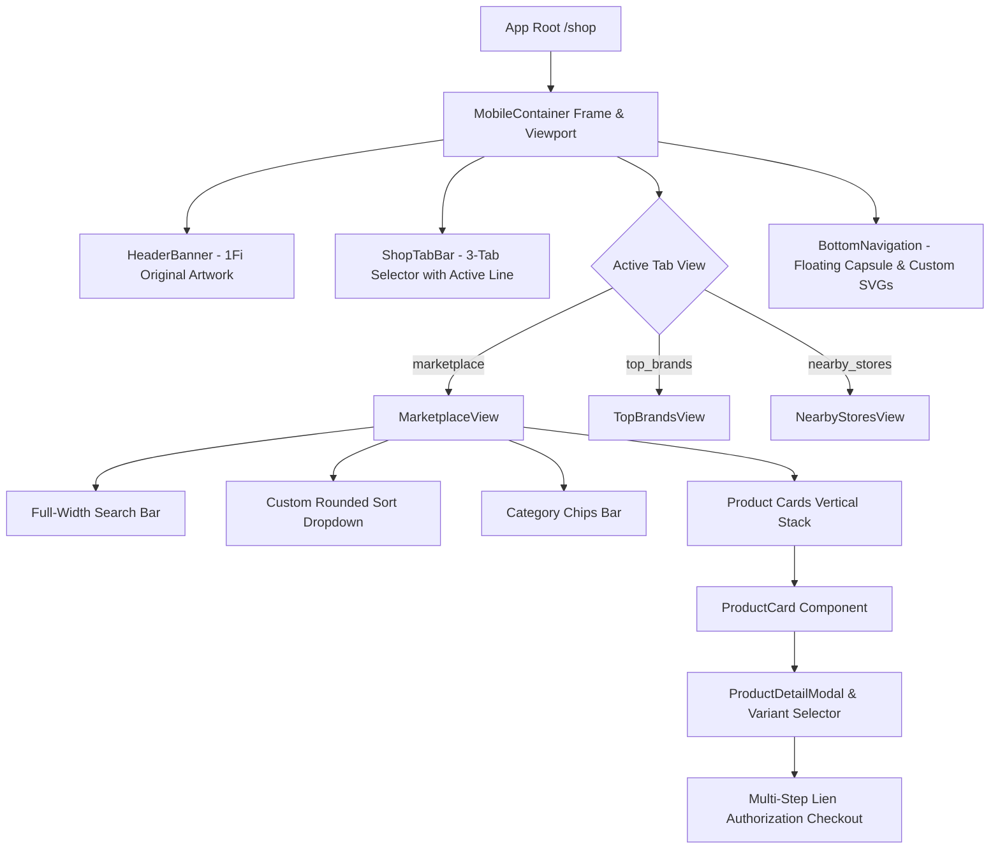

<div align="center">

# 🚀 1Fi App — 1Fi Marketplace Feature
### *SDE Intern Assignment Implementation*

[](https://nextjs.org/)
[](https://www.typescriptlang.org/)
[](https://tailwindcss.com/)
[](https://zustand-demo.pmnd.rs/)
[]()

<p align="center">
  <b>Shop today, Pay later using Mutual Funds. Zero credit score required. Zero interest.</b>
</p>

---

</div>

## 📌 Project Overview

This project implements the **1Fi Marketplace** section within the existing **Shop page** of the **1Fi app**. It provides a seamless mobile-first ecommerce experience where users can browse high-value products (Smartphones, Gold Bullion, EVs, Laptops, Luxury Watches, and Travel Vouchers), calculate custom **0% No-Cost EMI plans**, and complete orders backed by their **Mutual Fund portfolio collateral**.

---

## 🏗️ System Flow & User Journey



---

## ⚡ Component Architecture Hierarchy



---

## ✨ Key Features & Technical Highlights

| Feature | Description |
| :--- | :--- |
| **🛍️ 1Fi Marketplace** | Complete product catalog featuring iPhones, Tanishq 24K Gold, Ather EVs, MacBooks, and Luxury Watches. |
| **🧮 Interactive EMI Calculator** | Dynamic calculation for 3, 6, 9, 12, 18, and 24-month **0% No-Cost EMI** plans. |
| **🔒 Mutual Fund Lien Lock** | Automatic calculation of required Mutual Fund collateral value (e.g. ₹1,35,000 locked safely while continuing to earn market returns). |
| **🎨 Responsive Design Parity** | 100% pixel-perfect UI consistency with 1Fi design system (vibrant banner artwork, floating capsule nav bar, custom icons). |
| **⚡ Next.js App Router REST APIs** | Backend API endpoints supporting search, category filtering, sort parameters, and order placement. |

---

## 🛠️ Technology Stack

- **Frontend Core**: Next.js 16 (App Router), React 19, TypeScript 5
- **Styling & UI**: Tailwind CSS 4, Lucide Icons, Custom SVGs
- **State Management**: Zustand 5
- **Backend APIs**: React Next.js API Routes / Route Handlers
- **Data Source**: Dynamic REST API Endpoints & Structured Mock JSON

---

## 📡 REST API Specifications

### 1. Product Catalog API
- **Endpoint**: `GET /api/products`
- **Query Params**:
  - `category` *(optional)*: `smartphones`, `gold`, `ev-vehicles`, `electronics`, `appliances`, `watches`, `travel`
  - `q` *(optional)*: Search query string
  - `sort` *(optional)*: `popular`, `price_low`, `price_high`, `emi_low`

### 2. Product Details API
- **Endpoint**: `GET /api/products/[id]`
- **Response**: Full specs, highlights, variants, and available EMI matrices.

### 3. EMI & Collateral Calculation API
- **Endpoint**: `POST /api/emi-plans`
- **Payload**: `{ "amount": 119900, "tenureMonths": 12 }`
- **Response**: Monthly installment breakdown, mutual fund lock requirement, and interest savings vs credit cards.

### 4. Checkout & Mandate API
- **Endpoint**: `POST /api/checkout`
- **Payload**: `{ "productId": "...", "variantId": "...", "planId": "...", "address": {...} }`
- **Response**: Instant mandate confirmation ID & order ID.

---

## 📊 Mutual Fund EMI vs Credit Card EMI Comparison

| Metric | 💳 Credit Card EMI | 🚀 1Fi Mutual Fund EMI |
| :--- | :---: | :---: |
| **Interest Rate** | 16% – 24% p.a. | **0% No-Cost EMI** |
| **Processing Fee** | ₹199 – ₹999 | **₹0** |
| **Credit Score Impact** | High Utilization Impact | **Zero Credit Score Impact** |
| **Collateral** | Unsecured Credit Line | **Backed by your Mutual Funds** |
| **Investment Returns** | N/A | **Your Mutual Funds keep growing!** |

---

## 🚀 Getting Started & Local Setup

### Prerequisites
- **Node.js**: v18.0.0 or higher
- **npm**: v9.0.0 or higher

### Installation Steps

1. **Clone the Repository**
   ```bash
   git clone https://github.com/YOUR_USERNAME/1Fi-Marketplace.git
   cd 1Fi-Marketplace
   ```

2. **Install Dependencies**
   ```bash
   npm install --legacy-peer-deps
   ```

3. **Start Development Server**
   ```bash
   npm run dev
   ```

4. **Open in Browser**
   Navigate to [http://localhost:3000](http://localhost:3000) (Automatically redirects to `/shop`).

---

## 📁 Repository Structure

```
1Fi/
├── public/
│   └── images/               # Banner graphics & assets
├── src/
│   ├── app/
│   │   ├── page.tsx          # Root redirect to /shop
│   │   ├── layout.tsx        # Inter font & SEO Metadata
│   │   ├── globals.css       # Global styles & scrollbar utilities
│   │   ├── shop/
│   │   │   └── page.tsx      # Main 1Fi Shop Page
│   │   └── api/
│   │       ├── products/     # Catalog GET API
│   │       ├── emi-plans/    # Dynamic EMI POST API
│   │       └── checkout/     # Order placement POST API
│   ├── components/
│   │   ├── layout/           # MobileContainer, HeaderBanner, ShopTabBar, BottomNav
│   │   ├── shop/             # MarketplaceView, TopBrandsView, NearbyStoresView
│   │   └── marketplace/      # ProductCard, CategoryChips, ProductDetailModal, CheckoutModal
│   ├── data/
│   │   └── mockData.ts       # Products catalog, top brands & nearby stores dataset
│   ├── store/
│   │   └── useShopStore.ts   # Zustand state store
│   └── types/
│       └── product.ts        # TypeScript interfaces
├── README.md
└── package.json
```

---

<div align="center">
  <sub>Built with ❤️ for the 1Fi SDE Intern Assignment</sub>
</div>
